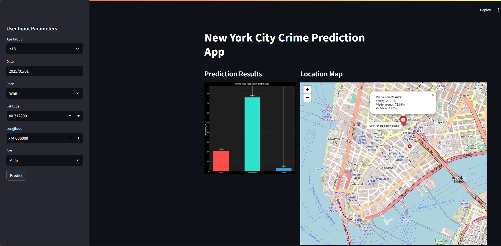

# **NYC Crime Probability Predictor**

## **Overview**
The NYC Crime Probability Predictor is a machine learning-powered application designed to help users understand and predict the likelihood and type of crimes in New York City. By leveraging historical crime data, the app provides insights into crime trends based on location, time, and other user-provided details.

## **Features**
- **Crime Type Prediction**: Anticipates the most likely type of crime based on input data.
- **Interactive Visualization**: Displays predicted probabilities and trends in an intuitive interface.
- **Real-Time Insights**: Provides up-to-date predictions for user-specific conditions.

## **Why This Project?**
Crime prediction has always been a challenging task due to its dynamic nature. This project bridges the gap between complex data and actionable insights, enabling users to make informed decisions by understanding crime trends in NYC.

## **DEMO**


---

## **Project Structure**

```
.
├── App              
├── notebooks                 
│   └── PrepareData&ModelTraining.ipynb   # Data preparation and machine learning model
├── docs                      # Project documentation
└── README.md
```

---

## **Dataset**
The project uses the **NYPD Complaint Data Historic Dataset**, which spans over a decade of reported crimes in NYC (2006-2019). The dataset includes:
- **6.9M reports**
- Spatial and temporal information
- Crime classifications and descriptions

---

## **Usage**

### 1. Clone the Repository
```bash
git clone https://github.com/yusufM03/crime-prediction-app.git
```

### 2. Install Dependencies
```bash
pip install -r requirements.txt
```

### 3. Run the App
Start the app:
```bash
cd App
python stream.py
```

---

## **Technologies Used**

- **Machine Learning**: Scikit-learn, Pandas, Numpy, XGBoost
- **Web Framework**: Streamlit
- **Data Visualization**: Matplotlib, Seaborn, Folium, Streamlit-Folium

---

## **Paper**
To document our work, we wrote a research paper that is included in the repo.  
[Download the Paper](Doc/paper.pdf)

---

## **Contributing**
We welcome contributions! Feel free to open an issue or submit a pull request.

---

## **Future Scope**
- Incorporating real-time data streams.
- Expanding to other cities and datasets.
- Enhancing the model for improved prediction accuracy.

---

## **Contact**
For questions or feedback, reach out to [Youssef Makhlouf](mailto:youssef.makhlouf@supcom.tn).
```
